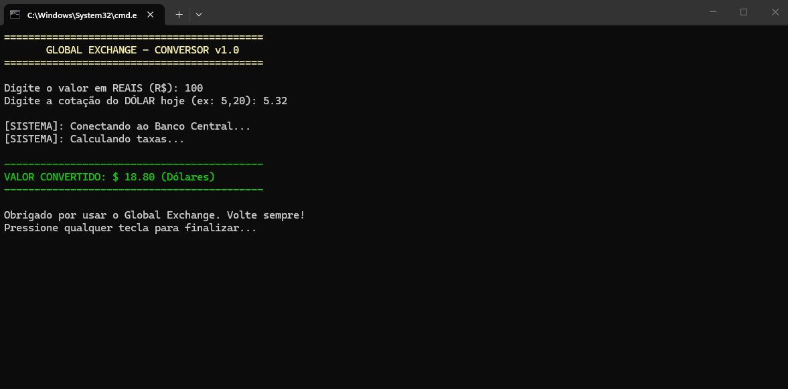

# 💱 Global Exchange - Conversor v1.0

Este projeto final consiste em uma ferramenta de conversão de moedas desenvolvida em C#, servindo como um estudo de caso prático para a implementação de três das **10 Heurísticas de Nielsen**.

## ⚖️ Heurísticas de Nielsen Aplicadas

O software foi construído focando na experiência do usuário (UX) em ambiente de terminal, utilizando os seguintes princípios:

### 1. Visibilidade do Status do Sistema (Heurística #1)
O usuário nunca fica "no escuro" durante o processamento.
*   **Feedback de Processamento:** O sistema informa que está "Conectando ao Banco Central" e utiliza uma animação de pontos (`...`) para simular o cálculo de taxas, mantendo o usuário ciente de que a aplicação está ativa e trabalhando.

### 2. Prevenção de Erros (Heurística #5)
O design previne falhas críticas e trata exceções de forma amigável.
*   **Tratamento de Exceções:** Através do bloco `try-catch`, o sistema evita o fechamento abrupto (crash) caso o usuário digite letras em campos numéricos.
*   **Mensagem Corretiva:** O erro é sinalizado visualmente com destaque vermelho e oferece uma instrução clara: *"Use apenas números e vírgula para decimais"*.

### 3. Estética e Design Minimalista (Heurística #8)
A interface apresenta apenas as informações necessárias, evitando poluição visual.
*   **Hierarquia Visual:** Uso de cores (`Yellow` para cabeçalhos, `Green` para resultados e `Red` para erros) para guiar o olhar do usuário.
*   **Organização de Dados:** O resultado final é emoldurado por divisórias, destacando o valor convertido de forma limpa e direta.

---

## 📸 Demonstração da Interface

Abaixo, a evidência do sistema aplicando os conceitos de status e estética:

## 🛠️ Detalhes Técnicos
- **Linguagem:** C# (.NET)
- **Funcionalidades:** Manipulação de strings, tratamento de exceções (Exception Handling) e controle de fluxo com `Thread.Sleep`.
- **Formatação:** Uso de `F2` para garantir que o valor monetário apresente apenas duas casas decimais.

---
*Projeto desenvolvido para fins educacionais em Interação Homem-Computador (IHC).*
